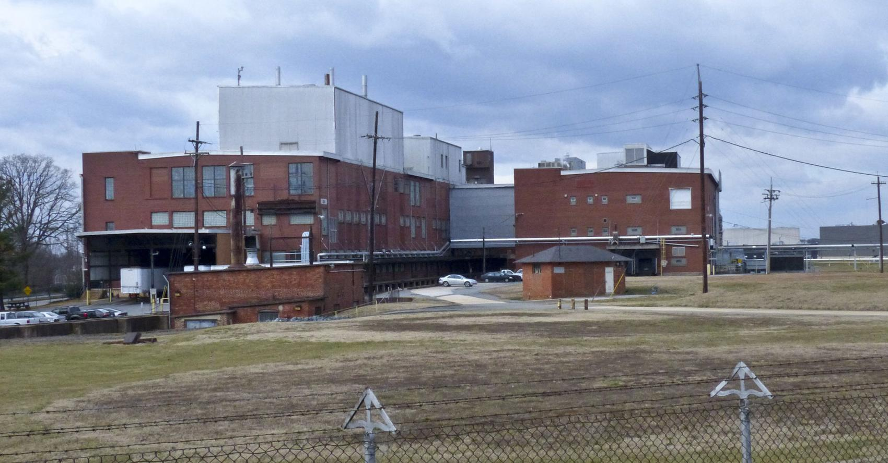

```{r echo=FALSE}
knitr::opts_chunk$set(echo = FALSE, message = FALSE, warning = FALSE)
cat <- function(...) {}
```

Urban development can be an exceptal thing for a community. It represents new funds being introduced to a community and can represent re-investment in older assets. However, unchecked redevelopment can be dangerous as well.

The _Wiston-Salem Journal_ [announced](https://www.journalnow.com/business/high-end-apartments-restaurant-and-retail-space--room-hotel/article_da57de02-b939-5f76-887f-7542df79e1bc.html) a project to convert previous RJ Reynolds industrial space into 125 room hotel, 25,000 sq ft of retail space, and 150 rental units. The transormation is expected to cost $100M and take place over five years.

The Whitaker Park Area, donated to Wake Forest and the Winston-Salem Development Authority, has been in my opinion roughly abandoned since Reynolds left the area and the factory has shut down. While Cook Medical devices are transitioning into the space, this is more of a transition of production than addition of new jobs.

```{r echo=FALSE, fig.cap="Former Reynolds Industrial Building in Whitaker Parl. Image by DAVID ROLFE/Journal file photo"}



```

# Setting the

One important component of any redevelopment project is to look at a map. If we do this we see that this industrial park and redevelopment site is near some pretty prized area (Wake Forest University; the Wake Forest football stadium, BB&T field, and not too far from the edge of the redeveloping downtown). Additionally, it is interesting to see that this is also along the border of the traditional Winston Salem racial (and income) boundary.

```{r echo=FALSE, message=FALSE, warning=FALSE}
library(tidyverse)
library(leaflet)

cities <- tribble(
  ~"city", ~"lat", ~"lon", 
  "Wake Forest University", 36.1334708,  -80.2772726,
  "Earl's", 36.10516, -80.245415,
  "Whitaker Park", 36.13439,-80.25255,
  "BB&T Field", 36.12883, -80.25605
)

leaflet() %>% 
  addTiles() %>% 
  addMarkers(lat = cities$lat, lng = cities$lon, 
             label = cities$city, popup = cities$city,labelOptions =
             labelOptions(noHide = T, direction = "top left"))
```

This can be seen when we lay the 2010 census data for persons claiming "White" on their responses.^[I hate to use "White"/ "Non-White" binary, but in the case of Winston-Salem, there has been a great deal of population sorting, so it becomes a somewhat reductionist, but useful way to understand the geography.] These development projects are in the center traditionally Black and non-white neighborhoods.


```{r echo=FALSE, message=FALSE, warning=FALSE}
library(tidycensus)
library(sf)
racevars <- c(White = "P005003")

forsyth <- suppressMessages(get_decennial(geography = "tract", variables = racevars, 
                  state = "NC", county = "Forsyth County", geometry = TRUE,
                  summary_var = "P001001", key = census_key, progress_bar = FALSE) )

forsyth <- forsyth %>%
  mutate(estimate = value/summary_value * 100)

pal <- colorQuantile(palette = "viridis", domain = forsyth$estimate, n = 10)

forsyth %>% 
    st_transform(crs = "+init=epsg:4326") %>%
    leaflet(width = "100%") %>%
  setView(lat = 36.1334708, lng = -80.2772726, zoom = 12) %>% 
    addProviderTiles(provider = "CartoDB.Positron") %>%
    addPolygons(popup = ~ str_extract(NAME, "^([^,]*)"),
                stroke = FALSE,
                smoothFactor = 0,
                fillOpacity = 0.7,
                color = ~ pal(estimate)) %>% 
  addLegend("bottomright", 
              pal = pal, 
              values = ~ estimate,
              title = "% White Based on 2010 Census",
              opacity = 1) %>% 
  addMarkers(lat = cities$lat, lng = cities$lon, 
             label = cities$city, popup = cities$city)
```

Stepping into median home value for the area then becomes important. As you can see in the map below, this area has some of the lowest median home values in the county.

```{r echo=FALSE, message=FALSE, warning=FALSE}
slc_value <- suppressMessages(get_acs(geography = "tract", 
                    variables = "B25077_001", 
                    state = "NC",
                    county = "Forsyth County",
                    geometry = TRUE, key = census_key,progress_bar = FALSE ))

pal <- colorNumeric(palette = "viridis", 
                    domain = slc_value$estimate)

slc_value %>%
    st_transform(crs = "+init=epsg:4326") %>%
    leaflet(width = "100%") %>%
  setView(lat = 36.1334708, lng = -80.2772726, zoom = 12) %>% 
    addProviderTiles(provider = "CartoDB.Positron") %>%
    addPolygons(popup = ~ str_extract(NAME, "^([^,]*)"),
                stroke = FALSE,
                smoothFactor = 0,
                fillOpacity = 0.7,
                color = ~ pal(estimate)) %>%
    addLegend("bottomright", 
              pal = pal, 
              values = ~ estimate,
              title = "Median Home Value",
              labFormat = labelFormat(prefix = "$"),
              opacity = 1) %>% 
  addMarkers(lat = cities$lat, lng = cities$lon, 
             label = cities$city, popup = cities$city)
```

# So What?

In summary this project is going to pump a good bit of money into a relatively poor area. Based on the previous project that this developper is known for ([Plant 64](https://www.plant64.com/) which retails apartments for ~1.6-2.2k/ month to medical students and high earning professionals), it will attract high income people into the area. This includes people who might be affiliated with Wake Forest University.

As this occurs property values will increase. As these property values increase, the taxes levied on these properties increases, in the absense of any changes, the disposable income for these people living in these areas will decrease. As this area has higher poverty to begin with, this might mean that some people can no longer afford their homes. This in turn, allows developers and people interested in continuing to capitalize on the property value to buy the property out from underneath these lower income persons. 

While some might argue that this increase in home value will profit those who live in these areas, we have to keep in mind that there is a mound of research on the effect of community. If you have lived in the same area for ages, odds are you have family and trusted neighbors. This in turn plays into a sense of belonging and community. Additionally, this a social network for helping with childcare [@coate_parental_2018], with transportation (as it is a needed resource and not everyone has reliable personal transportation), access to healthcare [@ahmed_barriers_2001] and allows for vibrant communties.^[There is some conflicting research on the effects of gentrification on communities. Some research finds that in cities that already have good social mobility gentrification can be beneficial. Social mobility is a big problem in Winston-Salem with some estimates placing Winston among cities with the lowest social mobility. See [@hwang_social_nodate] and [@freeman_displacement_2005] as well as ] Even if I make some money on real estate, I might not land in a similar community and might be at risk of deceased economic stability.

# What do we do?

The importance in all of this is that we need to make sure that these kinds of projects assess the impact on the people in the area. So far that has not been the case (at least with the Bailey Park redevelopment). City Council needs to be aware of the risks of these projects and make sure that safeguards or simultaneous development projects are in store for the impacted communities. This project provides that 20% of the housing units developed will be for "working class" people, which is vague, and does not really mean too much. If they take Section 8 vouchers, that would be more indicative of the kind of support that could take place.  All this to say we need to be conizant of the impact these kinds of projects have in our community. 

# Reuse

For attribution, please cite this work as [@dewitt]
```
DeWitt (2019, Oct. 13). Michael DeWitt: Stepping into Gentrification. 
Retrieved from https://www.nctriadresearch.com/post/stepping-into-gentrification/
```

```
@misc{dewitt,
  author = {DeWitt, Michael},
  title = {Michael DeWitt: Stepping into Gentrification},
  url = {https://www.nctriadresearch.com/post/stepping-into-gentrification/},
  year = {2019}
```

# References


